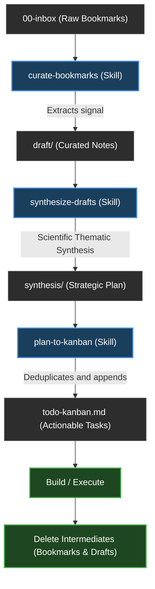

# Second Brain Operating System

This document defines the core philosophy, workflows, and operational logic of this Second Brain. It is a living document, updated as the system and its tools evolve.

## 1. Core Philosophy
- **Honest & Objective Thinking**: This is a second brain — the work is finding the best solution, not an agreeable one. Agents challenge weak work (including another agent's and their own), object plainly when something is wrong, hold their position under pushback unless genuinely proven wrong, and ground claims in verified evidence. Never flatter; never pass average work to keep the peace.
- **Lite over Large**: Keep the vault lean and high-signal. Delete *spent intermediates* (a bookmark once curated, a draft once synthesized) — git preserves history, so deletion is safe, and agents shouldn't burn tokens on dead files. Keep only durable outputs; a big graph is a vanity metric.
- **Strict Separation (The Hard Wall)**: Keep Work, Personal, and Resources folders strictly separated to prevent context bleed. However, cross-domain reasoning is enabled via the `type` frontmatter property (e.g. `evergreen`, `synthesis`), allowing cross-Area insights.
- **Link-First Architecture**: Knowledge value lives in the connections (`[[wikilinks]]`), not just the content.
- **Agent-Augmented, Not Agent-Led**: AI agents (Claude/Antigravity) automate the labor (curation, synthesis, linting) while the human retains the final understanding.

## 2. Vault Structure (ARA)
- **`00-inbox/`**: Raw captures, web clippings, and fleeting notes.
- **`01-work/`**: Areas of responsibility and active efforts related to professional life.
- **`02-personal/`**: Areas of interest and life management related to personal life.
- **`03-resources/`**: Reference library and topics of interest not tied to a specific responsibility.
- **`04-archive/`**: Inactive areas or resources; cold storage.
- **`99-system/`**: Metadata, templates, attachments, and system documentation.

## 3. The Operating Workflow (The Loop)
The core engine of the Second Brain is the continuous loop of capturing raw data, processing it into actionable insights, and pruning the waste.

### Workflow Stages:
1. **Capture**: Raw material lands in `00-inbox/`.
2. **Curate (`curate-bookmarks`)**: The agent reads the inbox items, extracts the core value ("what we can steal"), and moves them into a `draft/` folder within a specific Area. The source is logged in `processed-sources.md`.
3. **Synthesize (`synthesize-drafts`)**: The agent takes multiple drafts, analyzes them against each other using a scientific thematic matrix, and generates a unified Strategic Plan (`synthesis/`).
4. **Action (`plan-to-kanban`)**: The agent reads the Strategic Plan, extracts the actionable tasks, deduplicates them, and appends them to the Area's `todo-kanban.md`.
5. **Clean**: Once the knowledge is durable and actionable, the spent intermediates (the original bookmark and the draft) are deleted.

## 4. Operational Skills (Toolbelt)
- **`init-area`**: Interactively creates a new Area by challenging the idea, defining goals/scope, and scaffolding the required hub notes, Kanban board, and folders.
- **`scout-idea`**: Validates new ideas, challenges their utility, and scouts for external resources/tools to build them.
- **`curate-bookmarks`**: Processes inbox items into actionable Area drafts.
- **`synthesize-drafts`**: Synthesizes multiple drafts in an Area into a strategic "Global Plan" using scientific thematic synthesis.
- **`plan-to-kanban`**: Reads a synthesis document's action plan and extracts action items into the Area's Kanban board, deduplicating them.
- **`vault-linter`**: Read-only knowledge-graph integrity check — broken `[[wikilinks]]`, orphaned notes, and missing `source`/`captured_from` traceability. Never edits.
- **`audit-maintenance`**: Headlessly reviews pending maintenance tasks and peer-reviews tools created by other agents.

## 5. Peer Review & Maintenance
- **Review Loop**: `vault/99-system/maintenance/agent-kanban.md` is a Kanban board with swimlanes **Todo / In Progress / Done / Archived**. Every tool creation must be logged as a new card under **Todo**.
- **Session Check**: A `SessionStart` hook surfaces each agent's own pending reviews at session start by calling `.claude/hooks/pending-reviews.sh <Reviewer>`.
- **Quality Control**: A review *challenges and hardens* the other agent's work — judging whether it produces the best-quality output, not just whether it follows format. A pass is earned; weak tools are failed with concrete, required improvements.

## 6. Agent Conventions
- **Source of Truth**: Agents must read `CLAUDE.md` and this document before making structural changes.
- **No Direct Writes**: Agents write to `draft/` folders or specific system directories, never directly into the core of an Area without confirmation.
- **Traceability**: Every agent-created note must include a `source` or `captured_from` field.
- **Security Guardrails**: Agents stay inside the project directory and never read/write/exfiltrate credential or secret paths. Enforced per `CLAUDE.md §10`.

## 7. Post-Action Checklist
To ensure the system remains robust and documented, every major change triggers this checklist:
1. **Sync `README.md`**: Document the new capability or structural shift.
2. **Log `agent-kanban.md`**: Add a card under **Todo**, assigned to the other agent.
3. **Audit ARA**: Confirm that no "projects" folders were created.
