# 🧠 AI Second Brain — an agent-operated PKM template for Obsidian

> A self-pruning, high-signal **second brain** for **Obsidian**, operated by AI coding agents (**Claude Code** & **Antigravity**). Capture an idea → research it → synthesize a plan → ship actionable tasks. The vault is for *thinking*; the agents do the labor.

This repository is a **template**: clone it, open it in Obsidian, point your AI agent at it, and you have a working *knowledge operating system* — an ARA-structured vault plus a toolbelt of skills that turn raw bookmarks into strategic plans and tracked work. **No personal areas or notes are included** — you bring your own; the scaffolding and tooling are the product.

## ✨ Why this exists

Most "second brain" setups rot: you capture endlessly and synthesize never. This template makes **AI agents do the processing** — curating captures, synthesizing drafts into plans, extracting tasks, and linting the knowledge graph — while you keep the judgment. It is **agent-augmented, not agent-led**.

- **🔁 A capture → curate → synthesize → act loop** that prunes spent material as it goes (*lite over large*).
- **🧩 A toolbelt of skills** (slash commands) that automate the boring parts.
- **🗂️ ARA structure** (Areas / Resources / Archive) with a hard wall between Work, Personal, and Resources to stop context bleed.
- **🔗 Link-first**: value lives in the `[[wikilinks]]`, surfaced on a live dashboard.
- **🛡️ Security guardrails** that stop agents from reading or exfiltrating your secrets (SSH keys, `.env`, cloud credentials, shell history).
- **🤝 Dual-agent peer review**: one agent builds a tool, the other challenges and hardens it before it ships.

## 🔁 The Operating Loop

```mermaid
flowchart LR
    Inbox["00-inbox<br/>(raw bookmarks)"] --> Curate["curate-bookmarks"]
    Curate -->|extract signal| Draft["draft/<br/>(curated notes)"]
    Draft --> Synthesize["synthesize-drafts"]
    Synthesize -->|thematic synthesis| Plan["synthesis/<br/>(strategic plan)"]
    Plan --> Extract["plan-to-kanban"]
    Extract -->|dedupe + append| Kanban["todo-kanban.md<br/>(tasks)"]
    Kanban --> Execute["build / execute"]
    Execute --> Prune["delete spent<br/>intermediates"]
```

## 🗂️ Vault Structure (ARA)

| Folder | Purpose |
| --- | --- |
| `00-inbox/` | Raw captures, web clippings, fleeting notes — the entry point. |
| `01-work/` | Work areas of responsibility (kept strictly apart from personal). |
| `02-personal/` | Personal areas of interest and life management. |
| `03-resources/` | Reference library and topics not tied to a responsibility. |
| `04-archive/` | Inactive areas and cold storage. |
| `99-system/` | Templates, documentation, maintenance board, attachments. |
| `dashboard.md` | Live command center — pending work + browse-by-`type`, driven by the Tasks + Search plugins. |

## 🧰 The Toolbelt (Skills)

Run these as slash commands in Claude Code (or via the Skill tool):

- **`/init-area`** — scaffold a new Area: challenge the idea, define goals/scope, create the hub note, Kanban board, and triage queue.
- **`/curate-bookmarks`** — turn inbox captures into per-Area "what can we steal" drafts; judge each link independently; log the source.
- **`/scout-idea`** — challenge an idea's value, then run a broad discovery sweep for tools/OSS/articles when you have no bookmarks yet.
- **`/synthesize-drafts`** — analyze an Area's drafts against each other with a scientific thematic matrix and produce one strategic plan.
- **`/plan-to-kanban`** — extract the plan's action items into the Area's Kanban board, deduplicated.
- **`/vault-linter`** — read-only graph integrity check: broken `[[wikilinks]]`, orphan notes, missing traceability.
- **`/audit-maintenance`** — headless cross-agent peer review that challenges and hardens newly built tools.
- **`/security-guardrails`** — install a portable deny-list **plus** a `PreToolUse` hook that blocks shell reads of secrets, in *any* project.

## 🚀 Quickstart

1. **Use this template** (or clone the repo).
2. Open the `vault/` folder in **Obsidian** and enable the bundled community plugins: **Kanban**, **Tasks**, **Mermaid Tools**, **mdmenu**.
3. Install **[Claude Code](https://claude.com/claude-code)** (and/or Antigravity) and open the repo as your project — the agent reads `CLAUDE.md` automatically.
4. Create your first Area: `/init-area`.
5. Drop a link into `vault/00-inbox/`, then run `/curate-bookmarks` → `/synthesize-drafts` → `/plan-to-kanban`.

## 📚 Documentation

- **[Operating System doc](vault/99-system/documentation/second-brain-operating-system.md)** — the full philosophy, the loop, peer review, and the complete skill reference.
- **[Vault conventions](vault/99-system/documentation/conventions.md)** — frontmatter schema, tags, titles, link-before-close.
- **`CLAUDE.md`** — the master instruction set both agents follow (`GEMINI.md` is a symlink to it).

## 🛡️ Security

AI agents operate inside the project directory only. The included **`security-guardrails`** skill wires up a `permissions.deny` list **and** a `PreToolUse` hook so agents can't read or exfiltrate credential stores, `.env` files, private keys, tokens, or shell history — even via a shell `cat`. Harden any repo with `/security-guardrails`.

## 🤝 Contributing

Issues and PRs welcome — especially new skills and workflow improvements. New tooling is expected to pass the dual-agent peer review described in the Operating System doc.

## 📄 License

MIT © 2026 Ibrahim Kobeissy. See [LICENSE](LICENSE).
