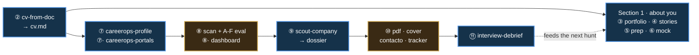
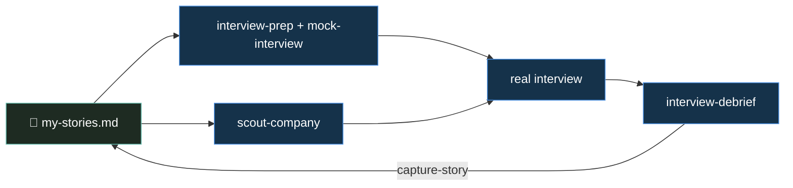

# Job-Hunt Toolset — user manual

Run a real job hunt powered by **vault skills you build** (`job-hunt-*`) plus **[career-ops](https://github.com/santifer/career-ops) you adopt**. The vault makes *you* sharp — CV, stories, prep, company dossiers — and **career-ops** finds roles, deep-scores them, and helps you apply. You hop between the two, and the toolset gets smarter the more you feed it.

> **Two homes, one shared file.** 🧰 the **vault** (`job-hunt-*` skills + your private data) and ⚙️ **career-ops** (a separate app in its own folder). Your `cv.md` lives in the vault and is **symlinked into career-ops**, so both read the same spine.

---

## The journey at a glance

**Legend** — 🟦 blue = in the **vault** (`/job-hunt-…`) · 🟫 gold = in **career-ops** (`/career-ops …`, its own folder). Solid = next step · dotted = loops back. Numbers = the order. Watch the colors alternate — that's you switching between the two tools. *(Your `cv.md` is shared into career-ops by a symlink — see Switching, below.)*

---

## The two spines — everything orbits these

| File | Written by | Read by |
| :-- | :-- | :-- |
| **`cv.md`** | ② `cv-from-doc` | ③ craft-profile · ⑦ careerops-profile · ⑦·⑤ careerops-portals · ⑨ scout-company · ⑥ mock-interview · **career-ops** (via symlink) |
| **`my-stories.md`** | ④ `capture-story` | ⑤ interview-prep · ⑥ mock-interview · ⑨ scout-company |

**One edit to a spine improves every skill that reads it.** Fix a metric in `cv.md` and your portfolio, career-ops scoring, and the me-vs matrix all improve at once. Add a story and your prep, drills, and company fit all sharpen.

---

## The walkthrough (in order)

| # | Where | Call | What it does → output |
| :-- | :-- | :-- | :-- |
| 1 | 🧰 you | drop CV PDF in `hunter/personal-profile/` | the raw input (private) |
| 2 | 🧰 | `/job-hunt-cv-from-doc` | reads the PDF, asks on ambiguity → **`cv.md`** (the spine) |
| 3 | 🧰 | `/job-hunt-craft-profile` | `cv.md` → a distinctive **`my-profile.html`** portfolio |
| 4 | 🧰 | `/job-hunt-capture-story` ×N | interviews you per work story → **`my-stories.md`** (STAR) |
| 5 | 🧰 | `/job-hunt-interview-prep` | story-backed answers to common Qs → **`interview-prep.md`** (flags gaps) |
| 6 | 🧰 | `/job-hunt-mock-interview` | drills you cold, scores candidly (tailors to a company if scouted) |
| 7 | 🧰 | `/job-hunt-careerops-profile` | `cv.md` → career-ops' **`profile.yml` + `_profile.md`** (archetypes, comp) |
| 7.5 | 🧰 | `/job-hunt-careerops-portals` | interviews you → career-ops' **`portals.yml`** scan targets (else `scan` = noise) |
| 8 | ⚙️ | `/career-ops scan` · `{paste JD}` · `pipeline` · `batch` | finds roles, **A–F deep-scores** each vs `cv.md` → `applications.md` |
| 8.5 | ⚙️ | `./dashboard/career-dashboard` | TUI to browse/sort the pipeline by score *(needs ≥1 eval first)* |
| 9 | 🧰 | `/job-hunt-scout-company <co>` | *complement* to career-ops `deep`: employee voice + **me-vs matrix** + **dossier.html** |
| 10 | ⚙️ | `/career-ops pdf · cover · contacto · apply · tracker · followup` | tailored CV, cover letter, outreach, application tracking |
| 11 | 🧰 | `/job-hunt-interview-debrief <co>` | retro → `debrief.md`; **mines new stories back into the bank** |
| — | 🧰 | `/job-hunt-starter` (anytime) | scans disk → **`starter.html`** pulse: what's done, what's stale, what's next |

---

## Switching between the vault and career-ops

You cross the line **four times** — that's by design (vault = bespoke, career-ops = the heavy engine):

1. **Vault → career-ops (setup):** Steps 7 + 7.5 *write into* career-ops from your `cv.md`. The CV itself is shared by a **symlink** (`cv.md` in career-ops → `hunter/personal-profile/cv.md`), so it's never two copies — edit it once in the vault.
2. **Into career-ops (find):** Step 8 runs inside career-ops — `cd ~/career-ops && claude` *(wherever you installed it)*. The first eval is what **creates `data/applications.md`**; until then the dashboard errors `could not find applications.md`.
3. **career-ops → vault (target):** pick a 4.0+ role, come back to the vault for Step 9. **career-ops already did the deep company research** (its `reports/` are richer) — `scout-company` only adds the shareable HTML dossier, the Glassdoor/Blind employee voice, and the me-vs-the-JD matrix.
4. **Vault → career-ops (apply) → vault (debrief):** apply via career-ops (Step 10), then debrief in the vault (Step 11).

---

## Why it compounds — the flywheel

Section 1 isn't a one-time setup; it's a **flywheel** the hunt keeps spinning:

Every interview **feeds the bank** (debrief → capture-story → `my-stories.md`), which makes the *next* prep, drill, and dossier better. A weak answer a mock exposes also becomes a prompt to capture the missing story. `job-hunt-starter` simply shows where the flywheel has gone cold and nudges you to spin it.

---

## career-ops quick reference

| Phase | Commands |
| :-- | :-- |
| **Find** | `/career-ops scan` · `/career-ops {paste URL or JD}` · `pipeline` (URL backlog) · `batch` (parallel) |
| **Score** | automatic **A–F deep eval** + scam/ghost-job check · `deep {co}` (extra intel) · `scan.mjs --verify` (liveness) |
| **Review** | `./dashboard/career-dashboard` · `tracker` · `patterns` — pursue **4.0+ only** |
| **Apply** | `pdf {co}` · `cover {co}` · `contacto {co}` · `apply` · `tracker` (bump Status) · `followup` |

> career-ops **never submits or sends** on its own — you approve every PDF, letter, and message. SPA job boards (LinkedIn etc.) need the Playwright MCP for `scan`.

---

*This is the usage guide for the `job-hunt-*` skills. The skills live in `.claude/skills/`; the adopted hub is [career-ops](https://github.com/santifer/career-ops).*
