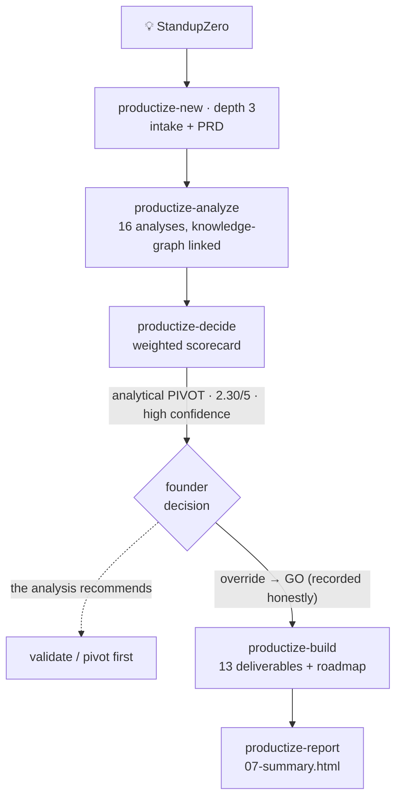

# Productize — a worked example (StandupZero, end to end)

The best way to understand the [[productize]] flow is to watch it run on a real, deliberately ordinary idea. This is **StandupZero** — "auto-draft each developer's daily standup from their real activity" — taken from a spark all the way to build specs and a visual report, unscripted.

> **The honest headline (this is the whole point).** Run on real evidence, the system recommended **PIVOT** at high confidence — it did **not** rubber-stamp the idea. The founder then chose to override to **GO**, and the system **recorded that override transparently**: the analysis stayed intact, the accepted risks were carried into every deliverable, and the build roadmap was made validation-gated. So the example shows two things at once — *the system challenges instead of flattering*, **and** *a human override is handled with integrity, not by quietly manufacturing a happy verdict.*

---

## The run, one screen

---

## What happened at each stage

| # | Stage | Outcome |
| --- | --- | --- |
| 1 | **Intake + PRD** (`productize-new`, depth 3) | A sharp PRD: problem → solution → positioning, three target segments, the revenue model, and §1.9 naming the two riskiest assumptions (draft quality; will engineers trust machine-written status?). |
| 2–4 | **Analysis** (`productize-analyze`) | The full **16-analysis** set, run in dependency order. Live web research found the decisive fact: **the auto-draft wedge is already shipping** (Kollabe, ZeroStandup) and the category leader (Geekbot) can copy it cheaply. |
| 5 | **Decision** (`productize-decide`) | Weighted scorecard **2.30 / 5 → PIVOT**, high confidence, traceable to every verdict. The binding dimension is competition/differentiation — even a perfect market score can't lift it past a pivot. |
| — | **Founder override** | The founder elected **GO** head-on. Recorded as `recommendation: GO` over an intact `analytical_recommendation: PIVOT`, with the accepted risks listed. The analysis was **not** rewritten. |
| 6 | **Build** (`productize-build`) | **13 deliverables** (7 product + 6 technical) + a **validation-gated roadmap**: phase R0 (a 2-week draft-quality spike, gate "≥70% of drafts posted with minor edits") runs *before* any significant build — so the override fails fast and cheap if the analysis was right. |
| ★ | **Report** (`productize-report`) | `07-summary.html` — the whole bet on one visual page (below). |

---

## Why the analysis landed where it did

Every lens converged on the same problem: **StandupZero is trivially buildable and cheap to run — which is exactly why it's hard to win.**

- **Competition = crowded · Differentiation = parity · USP = vague.** The wedge is already occupied; entry would be at parity with no lead.
- **Feasibility = risky.** Buildable, but not *winnable* for a solo, unfunded founder with no distribution.
- **Risk = high — dealbreaker present.** "No differentiation" × "no distribution" are both high-likelihood, high-impact, and already materializing.
- **One honest exit:** a privacy-first / self-hosted niche that cloud-SaaS rivals structurally can't follow — but that's a pivot, gated on a cheap validation test first.
- **A useful correction, too:** the PRD feared LLM cost; the financial analysis showed cost is ~3–5% of revenue — the real constraint is customer *acquisition*, not unit cost.

---

## The visual report (`07-summary.html`)

The capstone re-reads all 30+ artifacts and renders them as one self-contained, animated page. It opens with the honest **GO-over-PIVOT** dual badge — it summarizes the real conclusion, it doesn't sell.

> 📸 **Screenshots to embed here:**
> - the **hero** (the GO / PIVOT dual badge + vital-signs strip)
> - the **verdict matrix** (all 16 analyses with findings)
> - the **decision scorecard** (radar + the 2.30/5 gauge)
> - the **roadmap timeline** (R0–R3 with gates)
>
> *(captured from `07-summary.html`; see the Area below to open the live file.)*

What's on the page: an animated hero · a market-sizing funnel · a competitor positioning map · the full 16-analysis verdict matrix · a SWOT quadrant · financial scenarios · a risk likelihood×impact chart · the decision scorecard radar + gauge · a gated roadmap timeline — each backed by the real numbers from the artifacts.

---

## Where everything lives

The complete worked example ships as the **`standup-tools` Area** so you can read every artifact, not just this summary:

- **Upstream research:** the Area hub, the scout note, the curated drafts, the strategic synthesis.
- **The product (`standup-tools/standupzero/`):** `00-productization-plan.md` · `01-product-intake.md` · `02-prd.md` · **16 analyses** in `03-analyses/` · `04-report.md` · `05-go-no-go.md` · **13 deliverables + roadmap** in `06-deliverables/` · **`07-summary.html`**.

Read it top to bottom (the `NN-` prefixes are the intended order) to see exactly how each phase fed the next.
