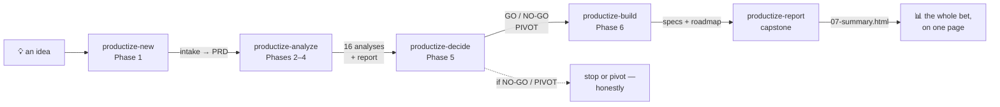

# Productize — take an idea from spark to spec

**Productize** turns a raw idea into a researched, decided, build-ready product — through **six skills**, one per stage of the flow. The vault does the *thinking* (research, analysis, decision, design); the actual app gets built **outside** the vault.

You give it an idea. It interrogates the idea, researches the market and competitors, runs a battery of analyses that build on each other, makes an honest **Go / No-Go** call, and — if you proceed — writes the product + technical specs and a roadmap. Optionally it caps the run with a single, shareable **visual HTML report**.

---

## The flow at a glance



Each phase **reads the phase before it.** The PRD is the single source of truth; every analysis writes a machine-readable verdict that later analyses (and the decision) consume. Nothing is asserted that isn't traceable to an artifact.

---

## The six skills

| Skill | Phase | What it does | Writes |
| --- | --- | --- | --- |
| **`productize-new`** | 1 | Adaptive 13-field intake (incl. the **depth dial** + an HTML-report opt-in) → standardized PRD (sections 1.1–1.9, edit-then-confirm) → control file | `00-productization-plan.md` · `01-product-intake.md` · `02-prd.md` |
| **`productize-analyze`** | 2–4 | Suggests the right analyses from the PRD; **you pick**; runs them in dependency order → one artifact per analysis + a concise report | `03-analyses/NN-*.md` · `04-report.md` |
| **`productize-decide`** | 5 | Weighted Go/No-Go scorecard over every analysis → **GO / CONDITIONAL GO / PIVOT / NO-GO** | `05-go-no-go.md` |
| **`productize-build`** | 6 | *(GO only)* Product (6A) + Technical (6B) deliverable specs + a roadmap | `06-deliverables/NN-*.md` |
| **`productize-report`** | capstone | Revisits **every** artifact → one self-contained, visual HTML page (charts, SWOT quadrant, roadmap timeline, scorecard radar, …). Outcome-agnostic, re-runnable | `07-summary.html` |
| **`productize-plan`** | — | Refreshes the control file from what's actually on disk (the manual fallback) | `00-productization-plan.md` |

> Output files carry an `NN-` prefix so the folder reads top-to-bottom in phase order. The number is read-order only; the knowledge graph resolves dependencies by a frontmatter **id**, so prefixes never break links.

---

## Choosing how deep to go — the depth dial

At intake, `productize-new` asks **how thorough** to be. One setting scales every artifact's rigor *and* how many analyses run:

| Level | Use when | Each artifact | Analyses run |
| --- | --- | --- | --- |
| **1 · Sketch** | gut-check / triage | summary + verdict + findings (qualitative) | core essential (~3–5) |
| **2 · Standard** *(default)* | a real go/no-go | structured, quantified, evidence-vs-assumption split | full relevant set |
| **3 · Investment-grade** | real capital / external stakeholders | + scenarios, sensitivity, alternatives, a research plan, active web research | relevant + secondary |

You can start at 2 and raise it later. Depth scales *rigor* — never invented certainty; the honesty rules hold at every level.

---

## What a product looks like on disk

A product is a folder inside its Area. You read it top to bottom:

```
areas/<area>/<product>/
├── <product>.md                # the product hub (the stable, named link target)
├── 00-productization-plan.md   # START HERE — the control file (phases, status, the analysis plan)
├── 01-product-intake.md        # Phase 1 — the 13 intake fields
├── 02-prd.md                   # Phase 1 — the PRD (single source of truth)
├── 03-analyses/                # Phases 2–4 — one file per analysis, numbered by run order
│   ├── 01-market-study.md
│   ├── 02-competitive-landscape.md
│   └── …
├── 04-report.md                # Phases 2–4 — the verdict table + a short synthesis
├── 05-go-no-go.md              # Phase 5 — the decision
├── 06-deliverables/            # Phase 6 — product + technical specs + roadmap (only if GO)
│   └── 01-…
└── 07-summary.html             # capstone — the visual report (opt-in)
```

---

## How the analyses build on each other

`productize-analyze` doesn't run the analyses in a random order — it sorts them so every analysis runs *after* the ones it depends on. It writes this **dependency map** into the control file before it runs, so the plan is legible up front. A real example (StandupZero, 16 analyses):

```
LEVEL 0 · no upstream      market-study · competitive-landscape · customer-discovery ·
                           industry-analysis · legal-scan
                                     │
                                     ▼
LEVEL 1                     feasibility ◄── market-study, competitive-landscape
                           financial-model ◄── market-study
                           competitive-differentiation ◄── competitive-landscape
                           … (value-prop, benchmarking, feature-gap, blue-ocean, swot, idea-validation)
                                     │
                                     ▼
LEVEL 2                     risk-assessment ◄── feasibility
                           usp ◄── value-proposition, competitive-differentiation
```

`◄──` = "depends on". Because `feasibility` runs *after* `market-study` and `competitive-landscape`, it reads their verdicts — so it genuinely builds on whether there's demand and whether there's room, instead of guessing.

---

## Honest by design

The point of a second brain is to find the *best* answer, not a flattering one. Productize bakes that in:

- **Real numbers where derivable, honest "unknown — needs research" elsewhere.** Thin evidence → `confidence: low` / `status: partial`, stated plainly. Never fake precision to look impressive.
- **A hard blocker caps the decision.** A legal blocker or a "not-viable" feasibility caps the Go/No-Go regardless of the score — the scorecard can't average a dealbreaker away.
- **Conflicts are surfaced, not silently resolved.** When a source contradicts a finding, it's flagged for you.
- **A weak case earns NO-GO or PIVOT** — not a comfortable hedge. (See the worked example: the analysis honestly recommended PIVOT against the founder's hope.)

---

## The capstone report

`productize-report` is the showpiece: it re-reads every artifact and renders **`07-summary.html`** — a single, self-contained page with a market funnel, competitor positioning map, the full verdict matrix, a SWOT quadrant, financial scenarios, a risk likelihood×impact chart, the decision scorecard, and a roadmap timeline. It **leads with the real verdict** (including any founder override) — a truthful summary, not a pitch deck. It's opt-in (it re-reads everything, so it costs tokens) and works for any outcome — a NO-GO report is just as useful, because it shows *why*.

See it in action: **[[productize-showcase]]** (the StandupZero end-to-end run).

---

## Quickstart

Each stage is a skill — invoke it as `/productize-<phase>` in Claude Code or `$productize-<phase>` in Codex (the product name argument is optional; it'll ask if omitted):

```
/productize-new ThreadDigest      # in the Area that owns the idea
/productize-analyze ThreadDigest  # pick the analyses, let it run
/productize-decide ThreadDigest   # get the honest GO / NO-GO / PIVOT call
/productize-build ThreadDigest    # if GO — generate the build specs + roadmap
/productize-report ThreadDigest   # the capstone visual summary (anytime)
```

That's it. Start with `productize-new` and follow the prompts; each skill tells you the next one.
