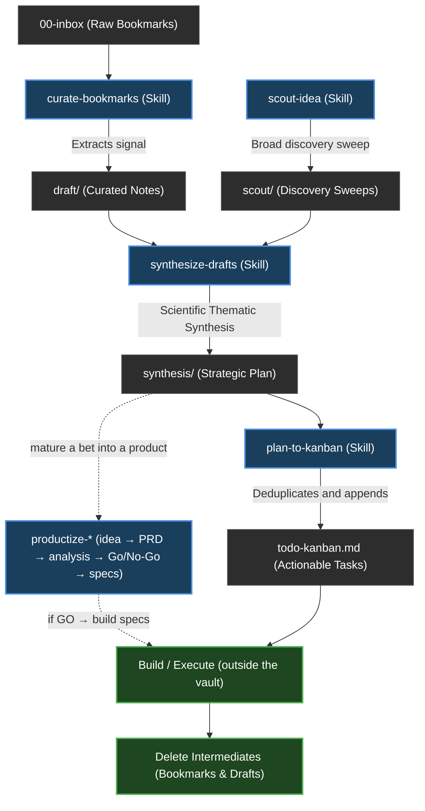

# Second Brain Operating System

This document defines the core philosophy, workflows, and operational logic of this Second Brain. It is a living document, updated as the system and its tools evolve.

> **🚀 First run — calibrate how the agents write to you.** When you set up the vault, run **`/calibrate-comms`** before anything else: it profiles how *you* want to be written to (length, structure, visuals, jargon, tone…) and persists those directives to `CLAUDE.md` §12 so every agent (Claude + Codex) matches your brain from day one. Everything below reads better once it's done. Guide: [[calibrate-comms]].

## 1. Core Philosophy
- **Honest & Objective Thinking**: This is a second brain — the work is finding the best solution, not an agreeable one. Agents challenge weak work (including another agent's and their own), object plainly when something is wrong, hold their position under pushback unless genuinely proven wrong, and ground claims in verified evidence. Never flatter; never pass average work to keep the peace.
- **Lite over Large**: Keep the vault lean and high-signal. Delete *spent intermediates* (a bookmark once curated, a draft once synthesized) — git preserves history, so deletion is safe, and agents shouldn't burn tokens on dead files. Keep only durable outputs; a big graph is a vanity metric.
- **Strict Separation (The Hard Wall)**: Keep Work, Personal, and Resources folders strictly separated to prevent context bleed. However, cross-domain reasoning is enabled via the `type` frontmatter property (e.g. `evergreen`, `synthesis`), allowing cross-Area insights.
- **Link-First Architecture**: Knowledge value lives in the connections (`[[wikilinks]]`), not just the content.
- **Agent-Augmented, Not Agent-Led**: AI agents (Claude/Codex) automate the labor (curation, synthesis, linting) while the human retains the final understanding.
- **Design Here, Build Elsewhere**: The vault is a whiteboard for thinking, researching, architecting, and planning — never for building applications. An Area matures a design until it's solid, then the actual tool/app is built in a **separate project outside the vault**. Source code and real/sensitive operational data (bank statements, credentials, live datasets) stay out of the vault. This is universal — it applies to every Area.

## 2. Vault Structure (ARA)
- **`00-inbox/`**: Raw captures, web clippings, and fleeting notes.
- **`01-work/`**: Areas of responsibility and active efforts related to professional life.
- **`02-personal/`**: Areas of interest and life management related to personal life.
- **`03-resources/`**: Reference library and topics of interest not tied to a specific responsibility.
- **`04-archive/`**: Inactive areas or resources; cold storage.
- **`99-system/`**: Metadata, templates, attachments, and system documentation.
- **`dashboard.md`** *(vault root)*: the mobile-first live command center — pipeline metrics, ranked exceptions, pressure-ranked Area Pulse, a vault-wide vitals strip, and a graph-health chip, all with in-dashboard drill-downs. A reusable DataviewJS view discovers all data from the vault; Create Diary (open/create today's diary entry) is its only write action.

### Dashboard command center

`[[dashboard]]` delegates to `99-system/views/dashboard/view.js` with styles scoped by `view.css`. Dataview 0.5.68 is the only added dependency (`enableDataviewJs: true`; inline JavaScript remains disabled); Tasks and Kanban continue to own their existing files, but the dashboard parses their Markdown rather than invoking either plugin.

Active Areas are discovered from immediate child folders of `01-work/areas/` and `02-personal/areas/`. An exact `<area-slug>.md` MOC supplies the display title and lifecycle when present; a missing hub falls back to the folder, while an archived hub/path is excluded. No Area name, count, or queue value is stored in the view.

| Tile | Live definition |
| :--- | :--- |
| To Test | Open `- [ ]` items in `03-resources/things-to-test.md` — a global phone-capture queue of links that couldn't be clipped to the inbox. Rendered **in relief** (a glowing coral tile) and ranked #1 in Needs Attention because it holds high-value captures; items open the URL directly in the browser. |
| Capture | Actionable Markdown under `00-inbox/`, excluding README/hidden/template/attachment paths and inactive lifecycle statuses. |
| Curate | Top-level unchecked items in each discovered Area's `to-check.md`. |
| Synthesize | Notes inside discovered Areas whose normalized `type` contains `draft` or `scout`, excluding archived/synthesized statuses and any note carrying `synthesized_into`. A source unsynthesized ≥21 days is flagged **stale**. |
| Plans | Notes in each Area's `synthesis/` whose `type` contains `synthesis`, excluding inactive statuses — the decided-but-not-yet-executed layer. A plan untouched ≥30 days is flagged **aging** ("decided, not moving"). |
| Execute | Top-level unchecked cards under `## Todo` or `## In Progress` in each discovered Area's `todo-kanban.md`; checked cards and Done/Archived lanes never count. |

Needs Attention builds only non-empty signals (top 6) and sorts them by `urgency × 1000 + magnitude` (magnitude capped at 999): things-to-test captures = urgency 5.5 (always #1 when present); pending maintenance reviews = urgency 5; strategic plan going stale = 4.5; largest open Kanban queue and inbox captures aged at least three days = 4; largest `to-check` queue = 3; oldest stale unsynthesized source = 2.5; largest synthesis backlog = 2; dormant Area (no edits ≥30 days) = 1.5. Ties resolve by the live age/count and then title. Area Pulse workload is `Execute + Curate + Synthesize` (Plans tracked separately); severity is relative to the highest current workload (`High ≥75%`, `Medium ≥40%`, otherwise `Low`, with zero shown as `Clear`); an Area holding any stale source or aging plan shows a corner dot, and responsive limits expose every overflow Area through a dynamic `+N more` drawer. Each Area drawer also shows its `last active` age and a Plans group.

A header **graph-health chip** recomputes broken `[[wikilinks]]` and orphaned notes from Obsidian's link index (`resolvedLinks`/`unresolvedLinks`, excluding archive/templates/attachments/READMEs) and opens a drawer listing both. A footer **Vault Vitals** strip shows whole-vault stats (Notes, Links, Areas, Plans, Stale, Dormant, Broken, Orphans), with the graph stats clickable into the same drawer. The view forces a concrete fill height (`min-height: calc(100dvh − header)`) because Obsidian's preview wrappers don't reliably cascade `height:100%` to a DataviewJS block.

Metric and Area clicks open exact-path drill-downs (right drawer on desktop, bottom sheet on mobile), so duplicate basenames cannot misroute navigation. Create Diary opens today's `02-personal/areas/second-brain/diaries/<YYYY>/<MM-Month>/<YYYY-MM-DD>.md` (creating it with the `diary` skill's `type: daily` schema + `[[second-brain]]` backlink if absent); all other controls are read-only navigation/filtering. A header **journal chip** beside it reads the diary filenames to show the current streak (`N-day streak` when today is logged) or a `Journal · Nd ago` nudge (amber at 1 day, coral beyond) — a habit cue, not a write.

#### Per-Area dashboards

Every Area also carries its own focused dashboard at `areas/<slug>/<slug>-dashboard.md` — a thin DataviewJS loader (`await dv.view("99-system/views/area-dashboard")`, `type: dashboard`) for the shared `99-system/views/area-dashboard/view.js`, which **reuses the global `view.css` verbatim** (one design system) and **auto-detects its Area from its own path** (so the loader is identical in every Area; no per-note config). It scopes to that Area: a header (domain · name · `Active Nd` · Hub/Kanban/To-check/↗All links), area-scoped metric tiles (To-Check · Drafts · Scouts · Plans · Execute), a per-Area **Needs Attention** column (aging plan, to-check backlog, stale source, dormant), and a **Work Board** panel that lists the Area's actual `## Todo` / `## In Progress` cards inline (the focused payoff over the global view's counts). `init-area` scaffolds it by default for new Areas.

## 3. The Operating Workflow (The Loop)
The core engine of the Second Brain is the continuous loop of capturing raw data, processing it into actionable insights, and pruning the waste.



### Workflow Stages:
1. **Capture**: Raw material lands in `00-inbox/` (global) or an Area's `to-check.md` (a per-Area triage queue of raw links/items). Both surface as pending work on the root [[dashboard]] until curated.
2. **Curate (`curate-bookmarks`)**: The agent judges each inbox item **independently**, extracts the core value ("what we can steal"), and writes a draft into the `draft/` folder of **every** Area it's genuinely relevant to (one, several — one area-specific draft each, cross-linked — or none). The source is logged in `processed-sources.md`, keyed per (URL, Area).
3. **Synthesize (`synthesize-drafts`)**: The agent takes multiple research notes — curated drafts (`draft/`) **and** scout sweeps (`scout/`), which are the same source class — analyzes them against each other using a scientific thematic matrix, and generates a unified Strategic Plan (`synthesis/`).
4. **Action (`plan-to-kanban`)**: The agent reads the Strategic Plan, extracts the actionable tasks, deduplicates them, and appends them to the Area's `todo-kanban.md`.
5. **Clean**: Once the knowledge is durable and actionable, the spent intermediates (the original bookmark and the draft) are deleted.

## 4. Operational Skills (Toolbelt)
- **`init-area`**: Interactively creates a new Area by challenging the idea, defining goals/scope, and scaffolding the required hub notes, Kanban board, `to-check.md` triage queue, and folders.
- **`scout-idea`**: Challenges a new idea's value, then runs a **broad discovery sweep** — a wide net of candidate tools/OSS/SaaS/articles/forum threads (verified picks + unverified candidates, grouped by sub-angle) for when you have no bookmarks yet, written to `scout/`. Scout *gathers*; `synthesize-drafts` narrows — it deliberately does not pre-pick the single best tool.
- **`curate-bookmarks`**: Processes inbox items into actionable Area drafts (`draft/`).
- **`synthesize-drafts`**: Synthesizes multiple research notes — drafts (`draft/`) and scouts (`scout/`), treated as the same source class — in an Area into a strategic "Global Plan" using scientific thematic synthesis.
- **`plan-to-kanban`**: Reads a synthesis document's action plan and extracts action items into the Area's Kanban board, deduplicating them.
- **`activity-timeline`**: Summarizes git history day-by-day, **grouped by Area**, into a horizontal swimlane timeline (`areas-activity-timeline.md`, **vault root**, beside `dashboard.md`) so you can see whether effort is spread evenly across Areas or piling into one. **Incremental** — a `last_commit` marker in the note means each run only summarizes commits since the last, never the whole history (`git log` → date×Area → LLM summary → merge into the note's ` ```chronos ` block → advance the marker). Renders via the **Chronos Timeline** community plugin (groups = swimlanes); read-only git, writes only that one note.
- **`vault-linter`**: Read-only knowledge-graph integrity check — broken `[[wikilinks]]`, orphaned notes, and missing `source`/`captured_from` traceability. Never edits.
- **`safe-delete-file`**: The *write-side inverse* of `vault-linter` — deletes a note/file but first finds every inbound link (`"what links resolve TO this file?"`, using the same parsing rules) and corrects it, so deletion never leaves dangling links. Default is **unlink** (`[[foo|Display]]` → `Display`); `--redirect <new>` repoints instead (rename/merge). Three blockers force a deliberate choice rather than a silent guess: **embeds** `![[foo]]` (no text equivalent), **ambiguous** bare links when another note shares the basename, and **context-loss risk** — a file that defers to the target for *content* (`see [[foo]]`), where the agent must ask the user to (a) force-delete, (b) **merge** the context into the referencing file first (recommended), or (c) abort. Deterministic Python; dry-run by default, deletes only on `--apply`; **never touches git**. Serves the lite / delete-when-done policy (§1).
- **`productize-linter`**: Read-only deterministic check for the productize toolkit — unique catalog ids, acyclic dependency graphs, resolving `depends_on`/`reads`, valid artifact frontmatter, `depends_on`↔body parity, no phantom plan links, and the build gate (non-illustrative Phase-6 deliverables require a GO). Catalog mode + per-product mode. The mechanical safety net for productize, mirroring `vault-linter` for the vault.
- **`audit-maintenance`**: Headlessly reviews pending maintenance tasks and peer-reviews tools created by other agents.
- **`security-guardrails`**: Portable, copy-paste skill that hardens *any* project against credential/secret access by agents — installs the `permissions.deny` list **plus** a `PreToolUse` hook (`guard-sensitive-paths.py`) that blocks shell reads (`cat`/`less`/`grep`/`cp`) the deny list misses, closing the gap noted in CLAUDE.md §10. Self-contained (`install.py` + `selftest.py`); not vault-specific.
- **`diary`**: Captures a dated journal entry into the **second-brain** area's `diaries/` folder, tidied into **year/month** sub-folders (`<YYYY>/<MM-Month>/<YYYY-MM-DD>.md`, e.g. `diaries/2026/06-June/2026-06-27.md`; `type: daily`). Resolves the date (today by default, or one named in the prompt — confirming ambiguous numeric dates as DD/MM), **classifies the entry under a category H2** (`## Work`, `## Personal / Family`, `## Freelance`, `## Life & Entourage`, extensible), then **evaluates insert-vs-create**: appends a new `### HH:MM` section under the right category in that day's note if it already exists, else creates it from the template; links `[[second-brain]]` so entries stay in the graph, and records only what the user actually says. The skill ships in the public template; the `diaries/` content stays private (not in `COPY_PATHS`; `verify.py` forbids a public `diaries/` sub-folder).
- **`analyse-diary`**: A power-dynamics **lens** over what `diary` captures. Reads a day's `diaries/<YYYY>/<MM-Month>/<date>.md`, **classifies each timestamped entry (`### HH:MM`, with its category H2 as a prior) for power-relevance** (a 1:1, a decision, a negotiation, a conflict, a reorg → map it; a coffee with a friend, errands, routine status → skip it; borderline → ask once), and for the relevant ones writes a **Power Map** (real decision-maker · hidden threats · unlikely allies · power moves · the one thing) to `diaries/power-maps/<date>-<HHMM>-<slug>.md` (keyed by the entry's time so same-day entries never collide; re-runs update maps in place rather than overwriting or duplicating), backlinked from the entry. **Grounded, not fabricated:** claims trace to what the entry records, guesses about people are marked as assumptions, and "strategy, not manipulation" is explicit. The skill ships publicly; the maps stay private (under `diaries/`, not in `COPY_PATHS`; `verify.py` forbids public `diaries/` **and** `power-maps/` sub-folders). **Full guide for both diary skills: [[diary]].**
- **`productize-*`:** a six-phase toolkit that takes an Area's idea from intake → PRD → analysis → Go/No-Go → implementation specs → a capstone visual report, via **six `productize-*` phase skills** (`new`, `analyze`, `decide`, `build`, `report`, `plan`) plus the component skills they invoke. Honest-by-design (thin evidence → low confidence; a hard blocker caps the decision; a weak case earns NO-GO/PIVOT, not a hedge); analyses build on each other through a frontmatter knowledge graph; a **depth dial** (1 Sketch / 2 Standard / 3 Investment-grade) scales rigor. Build code lives **outside** the vault (§1). **Full guide: [[productize]]** · **worked example: [[productize-showcase]]** · build contract: `.claude/skills/productize/conventions.md`.
- **`job-hunt-*`** (Area toolset for `02-personal/areas/job-hunt`): a personal job-hunt stack on **Plan A — career-ops is the execution hub**; these skills *feed* it (produce its inputs) and *beautify* what it can't. `job-hunt-cv-from-doc` (CV PDF/Word → structured `cv.md`, the spine) · `job-hunt-careerops-profile` (`cv.md` → career-ops' `config/profile.yml` + `modes/_profile.md`, written into the external career-ops install) · `job-hunt-careerops-portals` (interviews the user → career-ops' `portals.yml` scan targets: title/location/salary filters + a curated company list) · `job-hunt-craft-profile` (`cv.md` → portfolio HTML) · `job-hunt-capture-story` (STAR diary `hunter/career/my-stories.md`) · `job-hunt-interview-prep` (story-backed Q&A) · `job-hunt-mock-interview` (live scored drill) · `job-hunt-scout-company` (company dossier HTML + `me-vs-<company>.md`) · `job-hunt-interview-debrief` (post-interview retro) · `job-hunt-starter` (disk-state `starter.html` dashboard). The "Operator's Dossier" HTML aesthetic is shared across the HTML-producing skills. Outputs in `hunter/personal-profile/`, `hunter/career/`, `hunter/scouted-companies/` are **PII tracked to the user's private remote**, never sent externally, and excluded from the public sync (JH-06, pending). User manual: [[job-hunt-toolset]].
- **`calibrate-comms`**: Calibrates **how the agents write to this user** — a multi-phase profiler over **9 axes** (density · sequence · modality · abstraction · tradeoff appetite · detail · jargon · tone · context-giving). Each axis is seeded from a **validated short psychometric** as a *prior* (Need for Cognition, TIPI, Maximization-6, Need for Closure, Subjective Graph Literacy — **calibration, not classification**; no DISC/MBTI/VARK), then the prior is **overridden by a sample-reaction test** (revealed > stated preference), and the result is **compiled into operational writing directives** persisted to the `COMMS-PROFILE` block in **CLAUDE.md §12** — loaded every session, obeyed by Claude **and** Codex. Re-runnable, with a live correction loop. The full record is a re-runnable ledger at `vault/99-system/communication-profile/<user>.md`; a *filled* profile is **personal data** (public sync ships the empty placeholder). Design + grounding: [[communication-calibration-design]] · [[communication-calibration-instruments-landscape]].

## 5. Peer Review & Maintenance
- **Review Loop**: `vault/99-system/maintenance/agent-kanban.md` is a Kanban board with swimlanes **Todo / In Progress / Done / Archived**. Every tool creation must be logged as a new card under **Todo**.
- **Active Agents**: Claude is the master/source-of-truth agent for `.claude/` tooling; Codex is the active secondary reviewer/operator. No other secondary-agent instruction surface is active.
- **Session Check**: Claude's `SessionStart` hook surfaces pending reviews by calling `.claude/hooks/pending-reviews.sh Claude`. Codex must run `bash .claude/hooks/pending-reviews.sh Codex` explicitly at startup because it does not run Claude hooks.
- **Codex Review Commands**: Use `codex review --uncommitted` for local change review. For reviewer drills that must not edit files, use `codex exec --sandbox read-only ...`. Codex reviews are findings-first, read-only, and must not mutate git.
- **Codex Git Guardrails**: Active execpolicy rules live at `.codex/rules/default.rules` (the single canonical copy — no separate vault mirror, to avoid drift). A nested read-only `codex exec -C <repo>` probe proved this project path auto-loads. Explicit checks with `codex execpolicy check --rules .codex/rules/default.rules ...` deny mutating git commands (`add`, `commit`, `reset`, `checkout`, `fetch`, tags, remote mutation, etc.) while allowing read-only diagnostics (`status`, `diff`, `log`, `show`, `ls-files`).
- **Codex Hooks Decision**: No Codex hooks are load-bearing in this repo. Project-local hooks are documented by Codex, but non-managed command hooks require manual `/hooks` review/trust, so Phase 3 uses native sandbox + execpolicy for mechanical enforcement.
- **Public Template Parity**: Public sync tracks only verified shared surfaces: `.claude/` tooling, `.agents/skills` (symlink to `../.claude/skills` for Codex repo-skill discovery), the operating-system docs, `AGENTS.md` parity checks, and `.codex/rules/default.rules`. It rejects unsupported secondary-agent instruction surfaces and speculative `.codex` config/hooks/agents; public `CLAUDE.md` stays manually sanitized. **Area scaffolds:** an area can ship publicly as *structure + READMEs only* (a `SCAFFOLD_COPIES` pair in `sync.py` → a `SCAFFOLD_ONLY_AREAS` entry in `verify.py`); the **job-hunt** toolset uses this so its skills are public while CV/stories/dossiers never leave the private remote (`verify.py` FAILS on any non-README file in that public area).
- **Quality Control**: A review *challenges and hardens* the other agent's work — judging whether it produces the best-quality output, not just whether it follows format. A pass is earned; weak tools are failed with concrete, required improvements.

## 6. Agent Conventions
- **Source of Truth**: Agents must read `CLAUDE.md` and this document before making structural changes. Codex reads `AGENTS.md`, which is a symlink to `CLAUDE.md`.
- **Codex Tool Discipline**: The canonical skills are exposed to Codex via `.agents/skills` → `../.claude/skills` (Codex's documented repo skills path; one source, no duplication). Codex uses a tool by reading its `SKILL.md` and following it (invoked as `$skill-name`); do not add `.codex/agents`, config files, or hooks unless their load path and trust model are verified first. Verified repo-local Codex surfaces: `.codex/rules/default.rules` (execpolicy, auto-load proven) and the `.agents/skills` symlink (native invocation exercised with `$audit-maintenance`; skills are invoked with `$skill` or `/skills`, not as individual slash commands).
- **No Direct Writes**: Agents write to `draft/` folders or specific system directories, never directly into the core of an Area without confirmation.
- **Traceability**: Every agent-created note must include a `source` or `captured_from` field.
- **Security Guardrails**: Agents stay inside the project directory and never read/write/exfiltrate credential or secret paths. Enforced per `CLAUDE.md §10`.

## 7. Post-Action Checklist
To ensure the system remains robust and documented, every major change triggers this checklist:
1. **Sync `second-brain-operating-system.md`**: Document the new capability or structural shift.
2. **Log `agent-kanban.md`**: Add a card under **Todo**, assigned to the other agent.
3. **Audit ARA**: Confirm that no "projects" folders were created.
