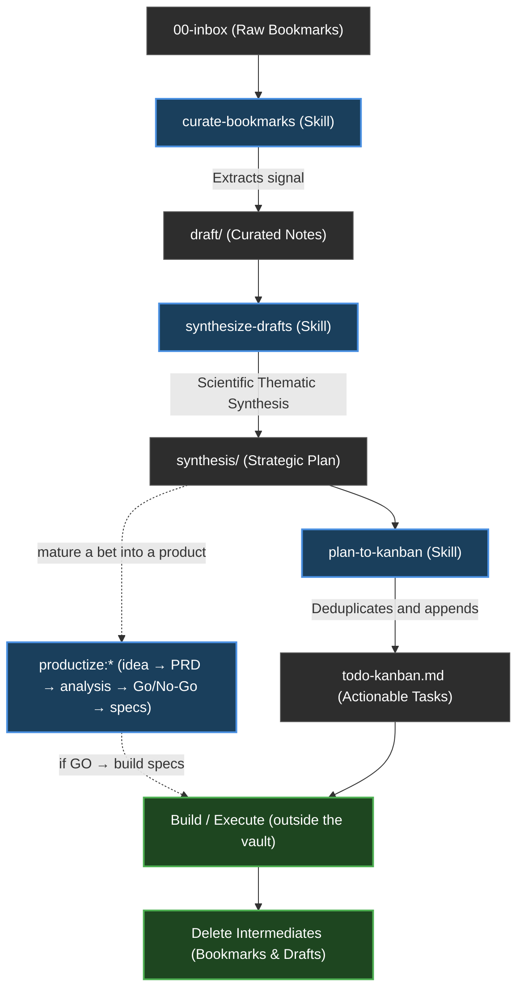

# Second Brain Operating System

This document defines the core philosophy, workflows, and operational logic of this Second Brain. It is a living document, updated as the system and its tools evolve.

## 1. Core Philosophy
- **Honest & Objective Thinking**: This is a second brain — the work is finding the best solution, not an agreeable one. Agents challenge weak work (including another agent's and their own), object plainly when something is wrong, hold their position under pushback unless genuinely proven wrong, and ground claims in verified evidence. Never flatter; never pass average work to keep the peace.
- **Lite over Large**: Keep the vault lean and high-signal. Delete *spent intermediates* (a bookmark once curated, a draft once synthesized) — git preserves history, so deletion is safe, and agents shouldn't burn tokens on dead files. Keep only durable outputs; a big graph is a vanity metric.
- **Strict Separation (The Hard Wall)**: Keep Work, Personal, and Resources folders strictly separated to prevent context bleed. However, cross-domain reasoning is enabled via the `type` frontmatter property (e.g. `evergreen`, `synthesis`), allowing cross-Area insights.
- **Link-First Architecture**: Knowledge value lives in the connections (`[[wikilinks]]`), not just the content.
- **Agent-Augmented, Not Agent-Led**: AI agents (Claude/Codex) automate the labor (curation, synthesis, linting) while the human retains the final understanding.
- **Design Here, Build Elsewhere**: The vault is a whiteboard for thinking, researching, architecting, and planning — never for building applications. An Area matures a design until it's solid, then the actual tool/app is built in a **separate project outside the vault**. Source code and real/sensitive operational data (bank statements, credentials, live datasets) stay out of the vault. This is universal — it applies to every Area.

## 2. Vault Structure (ARA)
- **`00-inbox/`**: Raw captures, web clippings, and fleeting notes.
- **`01-work/`**: Areas of responsibility and active efforts related to professional life.
- **`02-personal/`**: Areas of interest and life management related to personal life.
- **`03-resources/`**: Reference library and topics of interest not tied to a specific responsibility.
- **`04-archive/`**: Inactive areas or resources; cold storage.
- **`99-system/`**: Metadata, templates, attachments, and system documentation.
- **`dashboard.md`** *(vault root)*: the live command center — **pending work** across every Area (open Kanban cards, `to-check` items, unsynthesized drafts/scouts, uncurated inbox, open peer reviews) plus **browse-by-`type`** cross-domain retrieval. Driven by the Tasks + Search plugins; no script, updates itself from the files.

## 3. The Operating Workflow (The Loop)
The core engine of the Second Brain is the continuous loop of capturing raw data, processing it into actionable insights, and pruning the waste.

### Workflow Stages:
1. **Capture**: Raw material lands in `00-inbox/` (global) or an Area's `to-check.md` (a per-Area triage queue of raw links/items). Both surface as pending work on the root [[dashboard]] until curated.
2. **Curate (`curate-bookmarks`)**: The agent judges each inbox item **independently**, extracts the core value ("what we can steal"), and writes a draft into the `draft/` folder of **every** Area it's genuinely relevant to (one, several — one area-specific draft each, cross-linked — or none). The source is logged in `processed-sources.md`, keyed per (URL, Area).
3. **Synthesize (`synthesize-drafts`)**: The agent takes multiple drafts, analyzes them against each other using a scientific thematic matrix, and generates a unified Strategic Plan (`synthesis/`).
4. **Action (`plan-to-kanban`)**: The agent reads the Strategic Plan, extracts the actionable tasks, deduplicates them, and appends them to the Area's `todo-kanban.md`.
5. **Clean**: Once the knowledge is durable and actionable, the spent intermediates (the original bookmark and the draft) are deleted.

## 4. Operational Skills (Toolbelt)
- **`init-area`**: Interactively creates a new Area by challenging the idea, defining goals/scope, and scaffolding the required hub notes, Kanban board, `to-check.md` triage queue, and folders.
- **`scout-idea`**: Challenges a new idea's value, then runs a **broad discovery sweep** — a wide net of candidate tools/OSS/SaaS/articles/forum threads (verified picks + unverified candidates, grouped by sub-angle) for when you have no bookmarks yet. Scout *gathers*; `curate-bookmarks` narrows — it deliberately does not pre-pick the single best tool.
- **`curate-bookmarks`**: Processes inbox items into actionable Area drafts.
- **`synthesize-drafts`**: Synthesizes multiple drafts in an Area into a strategic "Global Plan" using scientific thematic synthesis.
- **`plan-to-kanban`**: Reads a synthesis document's action plan and extracts action items into the Area's Kanban board, deduplicating them.
- **`vault-linter`**: Read-only knowledge-graph integrity check — broken `[[wikilinks]]`, orphaned notes, and missing `source`/`captured_from` traceability. Never edits.
- **`safe-delete-file`**: The *write-side inverse* of `vault-linter` — deletes a note/file but first finds every inbound link (`"what links resolve TO this file?"`, using the same parsing rules) and corrects it, so deletion never leaves dangling links. Default is **unlink** (`[[foo|Display]]` → `Display`); `--redirect <new>` repoints instead (rename/merge). Three blockers force a deliberate choice rather than a silent guess: **embeds** `![[foo]]` (no text equivalent), **ambiguous** bare links when another note shares the basename, and **context-loss risk** — a file that defers to the target for *content* (`see [[foo]]`), where the agent must ask the user to (a) force-delete, (b) **merge** the context into the referencing file first (recommended), or (c) abort. Deterministic Python; dry-run by default, deletes only on `--apply`; **never touches git**. Serves the lite / delete-when-done policy (§1).
- **`productize-linter`**: Read-only deterministic check for the productize toolkit — unique catalog ids, acyclic dependency graphs, resolving `depends_on`/`reads`, valid artifact frontmatter, `depends_on`↔body parity, no phantom plan links, and the build gate (non-illustrative Phase-6 deliverables require a GO). Catalog mode + per-product mode. The mechanical safety net for productize, mirroring `vault-linter` for the vault.
- **`audit-maintenance`**: Headlessly reviews pending maintenance tasks and peer-reviews tools created by other agents.
- **`security-guardrails`**: Portable, copy-paste skill that hardens *any* project against credential/secret access by agents — installs the `permissions.deny` list **plus** a `PreToolUse` hook (`guard-sensitive-paths.py`) that blocks shell reads (`cat`/`less`/`grep`/`cp`) the deny list misses, closing the gap noted in CLAUDE.md §10. Self-contained (`install.py` + `selftest.py`); not vault-specific.
- **`productize-*`:** a six-phase toolkit that takes an Area's idea from intake → PRD → analysis → Go/No-Go → implementation specs → a capstone visual report, via **six `productize-*` phase skills** (`new`, `analyze`, `decide`, `build`, `report`, `plan`) plus the component skills they invoke. Honest-by-design (thin evidence → low confidence; a hard blocker caps the decision; a weak case earns NO-GO/PIVOT, not a hedge); analyses build on each other through a frontmatter knowledge graph; a **depth dial** (1 Sketch / 2 Standard / 3 Investment-grade) scales rigor. Build code lives **outside** the vault (§1). **Full guide: [[productize]]** · **worked example: [[productize-showcase]]** · build contract: `.claude/skills/productize/conventions.md`.

## 5. Peer Review & Maintenance
- **Review Loop**: `vault/99-system/maintenance/agent-kanban.md` is a Kanban board with swimlanes **Todo / In Progress / Done / Archived**. Every tool creation must be logged as a new card under **Todo**.
- **Active Agents**: Claude is the master/source-of-truth agent for `.claude/` tooling; Codex is the active secondary reviewer/operator. No other secondary-agent instruction surface is active.
- **Session Check**: Claude's `SessionStart` hook surfaces pending reviews by calling `.claude/hooks/pending-reviews.sh Claude`. Codex must run `bash .claude/hooks/pending-reviews.sh Codex` explicitly at startup because it does not run Claude hooks.
- **Codex Review Commands**: Use `codex review --uncommitted` for local change review. For reviewer drills that must not edit files, use `codex exec --sandbox read-only ...`. Codex reviews are findings-first, read-only, and must not mutate git.
- **Codex Git Guardrails**: Active execpolicy rules live at `.codex/rules/default.rules` (the single canonical copy — no separate vault mirror, to avoid drift). A nested read-only `codex exec -C <repo>` probe proved this project path auto-loads. Explicit checks with `codex execpolicy check --rules .codex/rules/default.rules ...` deny mutating git commands (`add`, `commit`, `reset`, `checkout`, `fetch`, tags, remote mutation, etc.) while allowing read-only diagnostics (`status`, `diff`, `log`, `show`, `ls-files`).
- **Codex Hooks Decision**: No Codex hooks are load-bearing in this repo. Project-local hooks are documented by Codex, but non-managed command hooks require manual `/hooks` review/trust, so Phase 3 uses native sandbox + execpolicy for mechanical enforcement.
- **Public Template Parity**: Public sync tracks only verified shared surfaces: `.claude/` tooling, `.agents/skills` (symlink to `../.claude/skills` for Codex repo-skill discovery), the operating-system docs, `AGENTS.md` parity checks, and `.codex/rules/default.rules`. It rejects unsupported secondary-agent instruction surfaces and speculative `.codex` config/hooks/agents; public `CLAUDE.md` stays manually sanitized.
- **Quality Control**: A review *challenges and hardens* the other agent's work — judging whether it produces the best-quality output, not just whether it follows format. A pass is earned; weak tools are failed with concrete, required improvements.

## 6. Agent Conventions
- **Source of Truth**: Agents must read `CLAUDE.md` and this document before making structural changes. Codex reads `AGENTS.md`, which is a symlink to `CLAUDE.md`.
- **Codex Tool Discipline**: The canonical skills are exposed to Codex via `.agents/skills` → `../.claude/skills` (Codex's documented repo skills path; one source, no duplication). Codex uses a tool by reading its `SKILL.md` and following it (invoked as `$skill-name`); do not add `.codex/agents`, config files, or hooks unless their load path and trust model are verified first. Verified repo-local Codex surfaces: `.codex/rules/default.rules` (execpolicy, auto-load proven) and the `.agents/skills` symlink (native invocation exercised with `$audit-maintenance`; skills are invoked with `$skill` or `/skills`, not as individual slash commands).
- **No Direct Writes**: Agents write to `draft/` folders or specific system directories, never directly into the core of an Area without confirmation.
- **Traceability**: Every agent-created note must include a `source` or `captured_from` field.
- **Security Guardrails**: Agents stay inside the project directory and never read/write/exfiltrate credential or secret paths. Enforced per `CLAUDE.md §10`.

## 7. Post-Action Checklist
To ensure the system remains robust and documented, every major change triggers this checklist:
1. **Sync `second-brain-operating-system.md`**: Document the new capability or structural shift.
2. **Log `agent-kanban.md`**: Add a card under **Todo**, assigned to the other agent.
3. **Audit ARA**: Confirm that no "projects" folders were created.
